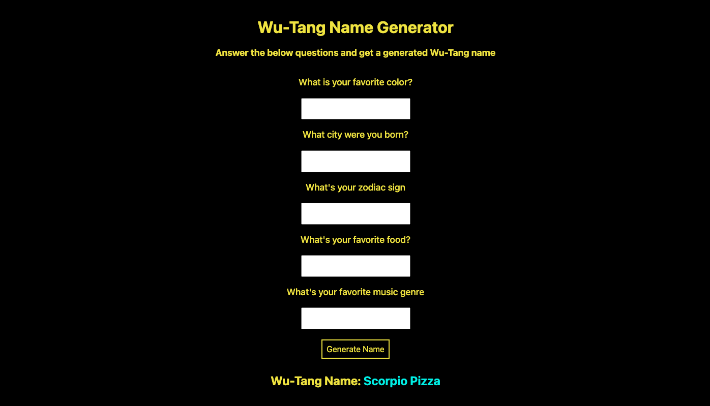

# Wu-Tang Name Generator 

This application generates a personalized Wu-Tang Clan name for users based on their answers to a short survey. By answering five fun questions, users receive a unique, randomly generated name.

**Project Link**: https://wu-tang-name-gen.netlify.app/

## Features
- **Survey Interaction:** Users complete a set of 5 questions to provide input for their name generation.
- **Randomized Name Generation:** Generates a unique Wu-Tang Clan-inspired name based on survey answers.
- **Interactive Experience:** Fun and creative way to engage users with a quirky result.

## Technology Used
- HTML
- CSS
- JavaScript

### Screenshots
